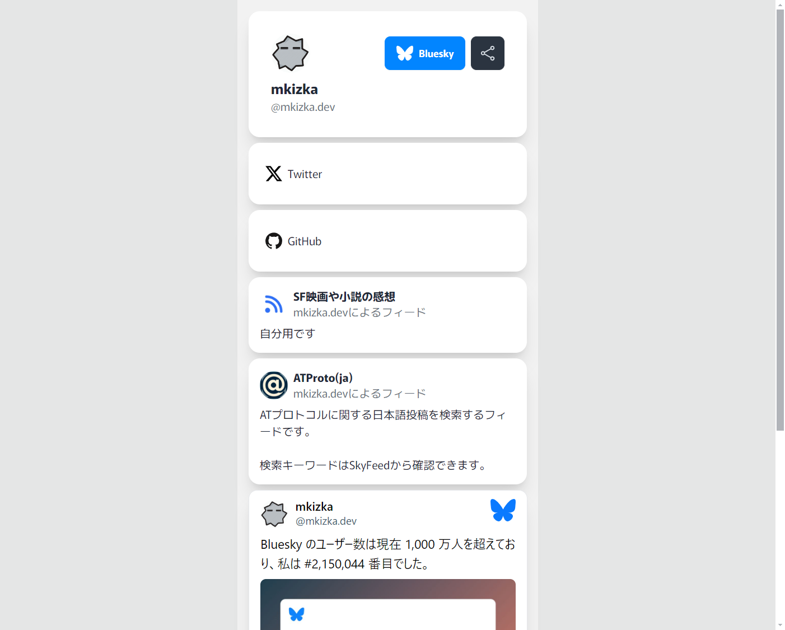

# Linkat

Organize your links using your Bluesky account.



## Development

To develop locally, ensure you have the following installed:

- Node.js
- Docker

Then, follow these steps to set up and run the project:

```
cp -f .env.example .env
corepack enable pnpm
pnpm install
pnpm dev
```

After running the commands, open [http://linkat.localhost:3000](http://linkat.localhost:3000) in your browser.

## Contributing

Issues and pull requests are welcome!
