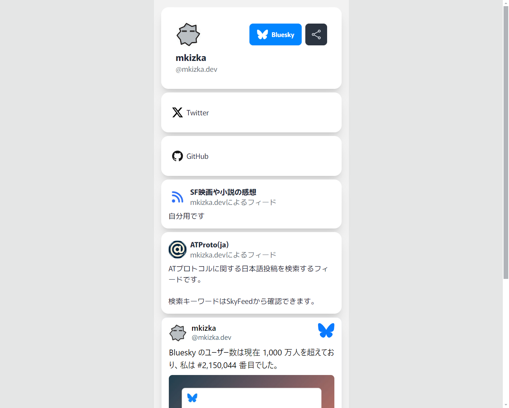

# Linkat

Organize your links using your Bluesky account.



## Development

To develop locally, ensure you have the following installed:

- Node.js
- Docker

Then, follow these steps to set up and run the project:

```
cp -f .env.example .env
corepack enable pnpm
pnpm install
pnpm dev
```

This connects to the real Bluesky network (no local PDS is started), so OAuth login requires HTTPS access to `http://localhost:3000`. Set up a tunnel (e.g. Cloudflare Tunnel, ngrok) and override `PUBLIC_URL` in `.env` to point to it.

After running the commands, open your `PUBLIC_URL` in your browser.

## Contributing

Issues and pull requests are welcome!
